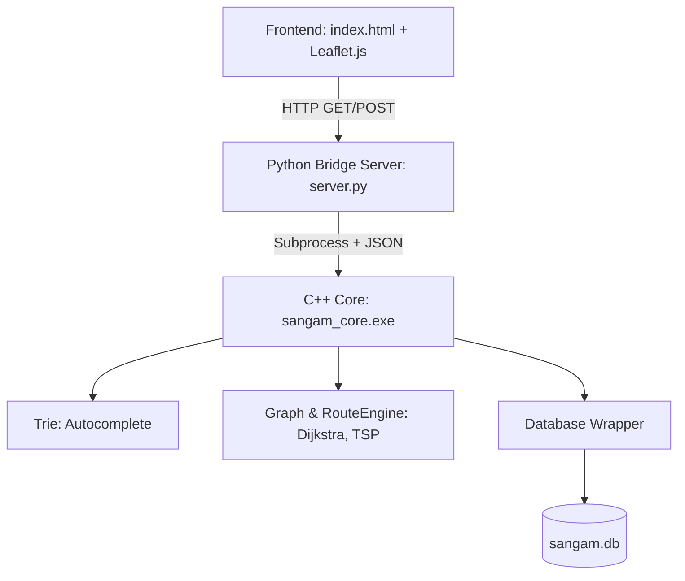

# Architecture

## Overview
Sangam uses a hybrid architecture, combining a lightweight frontend mapping interface with a high-performance C++ core that handles data structures (Trie, Graphs, Hash Tables) and optimization algorithms (Dijkstra, Nearest Neighbour).

## Module Interaction Diagram

## Data Flow
1. **Startup:** `server.py` starts and serves frontend resources.
2. **Initial Load:** `index.html` calls `/api/places` to fetch all map markers.
3. **Search:** Typing in the search bar triggers `/api/search?q=...` which is resolved by the C++ `Trie`.
4. **Optimization:** Creating an itinerary and clicking "Optimize" triggers a POST to `/api/route/optimize`.
   - The CLI builds the Graph from SQLite.
   - It runs Dijkstra's between all pairs.
   - It performs Nearest Neighbour TSP.
   - It reconstructs the full path and returns it.
5. **Saving:** The `/api/itineraries` endpoint persists the chosen order via the SQLite database.
